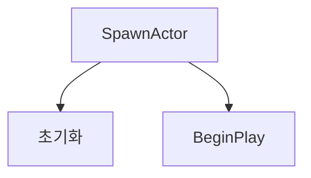
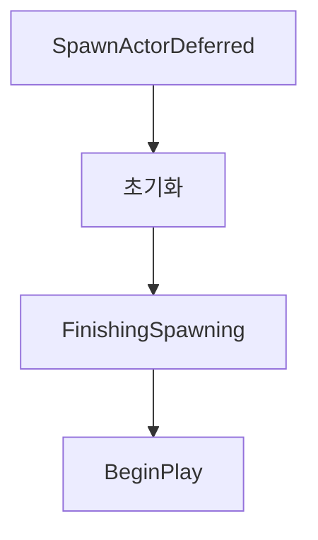

## 즉시 생성
---

```cpp
const FVector SpawnLocation = GetActorLocation() + FVector::UpVector * 88.0f;
AActor* OpponentActor = GetWorld()->SpawnActor(OpponentClass, &SpawnLocation, &FRotator::ZeroRotator);
AABCharacterNonPlayer* ABOpponentCharacter = Cast<AABCharacterNonPlayer>(OpponentActor);
```

## 지연 생성
---

- BeginPlay()가 불리기 전에 값을 셋팅하고 싶을 때 사용

###  Flowchart1


### Flowchart2


### 예시 코드
```cpp
const FTransform SpawnTransform(GetActorLocation() + FVector::UpVector * 88.0f);
AABCharacterNonPlayer* ABOpponentCharacter = GetWorld()->SpawnActorDeferred<AABCharacterNonPlayer>(OpponentClass, SpawnTransform);
if (ABOpponentCharacter)
{
	ABOpponentCharacter->OnDestroyed.AddDynamic(this, &AABStageGimmick::OnOpponentDestroyed);
	ABOpponentCharacter->SetLevel(CurrentStageNum);
	ABOpponentCharacter->FinishSpawning(SpawnTransform);
}
```